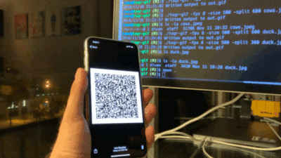

# TXQR

TXQR (Transfer via QR) is a protocol and set of tools and libs to transfer data via animated QR codes. It uses [fountain codes](https://en.wikipedia.org/wiki/Fountain_code) for error correction.

See related blog posts for more details:
 - [Animated QR data transfer with Gomobile and Gopherjs](https://divan.github.io/posts/animatedqr/)
 - [Fountain codes and animated QR](https://divan.github.io/posts/fountaincodes/)

# Demo

Reader iOS app in the demo (uses this lib via Gomobile): [https://github.com/divan/txqr-reader](https://github.com/divan/txqr-reader)

## Automated tester app
Also see `cmd/txqr-tester` app for automated testing of different encoder parameters.

# Licence

MIT
