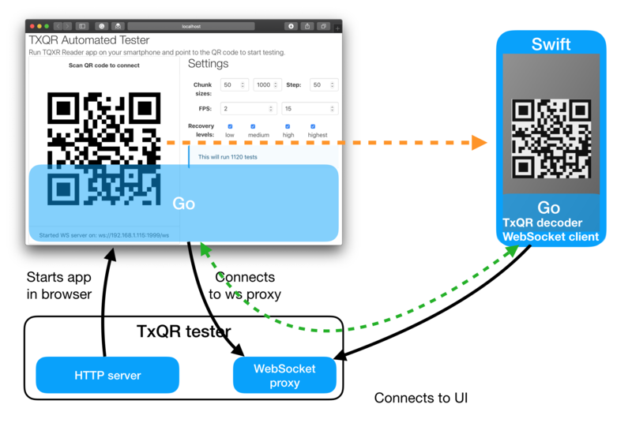
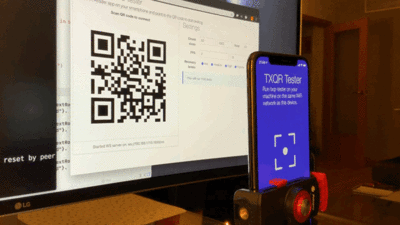

# TxQR tester app

App for automating testing different TxQR encoder parameters and measuring
time to transfer to real smartphone device using [txqr-tester-ios](https://github.com/divan/txqr-tester-ios).

# Design


# Usage

```
go build
./txqr-tester
```
it will open browser automagically and display QR code. Change testing settings, put mobile phone onto the tripod, open txqr-tester-ios app and scan QR. The rest will happen automatically. You'll see the results table instead of Settings, and the button to download results in CSV.

# Demo
-[]
